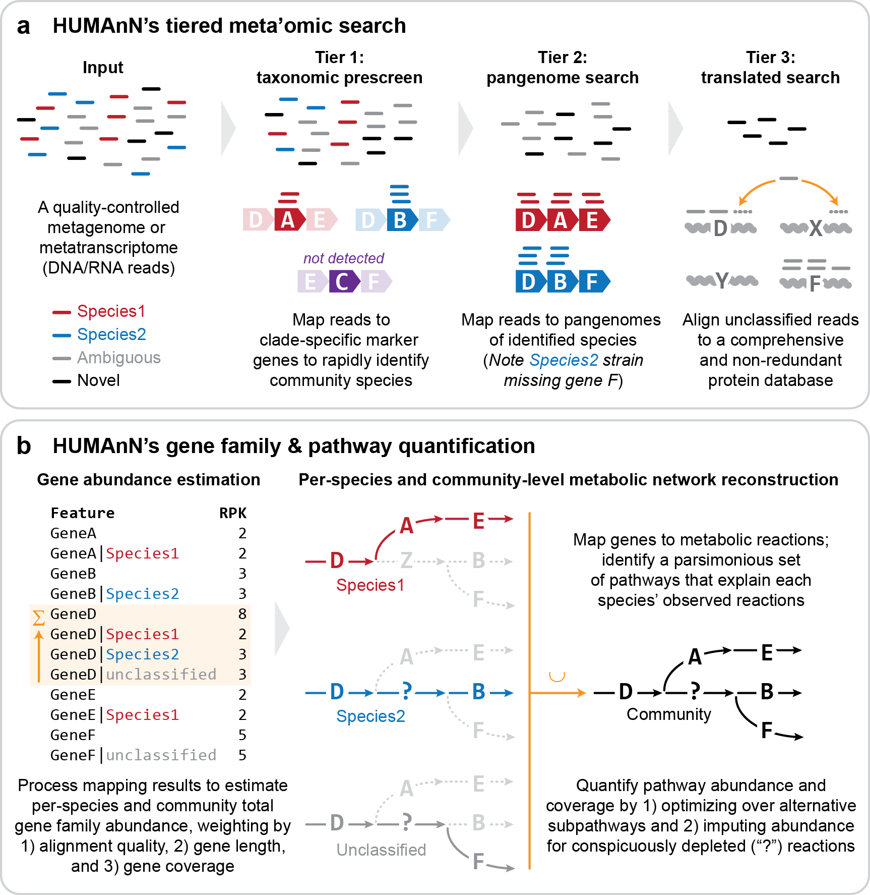

# HUMAnN3
HUMAnN3 is a tool designed to accurately and efficiently determine the abundance of microbial metabolic pathways and molecular functions from metagenomic or metatranscriptomic sequencing data. This tool will be explored during the internship

----

## Overview

----

# Tools used by HUMAnN3
* Python (>= 3.7)
* MetaPhlAn (version >= 3.0)
* Bowtie2 (version >= 2.2)
* DIAMOND (=0.9.36)
* MinPath

----
## Setup

The setup off a working conda environment was perfected and outlined on the wiki page [Setup](https://github.com/ThibaultWilmsen/HUMAnN3/wiki/Setup).

----

## Repository structure
* `1.Images/`: images used in documentation
* `2.Conda_env/`:  Contains .yml file used to build conda environment
* `3.Data/`: Used to store datafiles in .fasta .fastq .sam .b8 format   
* `4.Output/`: Used as output directory of HUMAnN3  
* `humann_dbs/`: Store reference genomes and annotation files here.   
* `README.md`: This document  

----

## Questions?
If you have any questions contact me at thibault.wilmsen@student.howest.be

